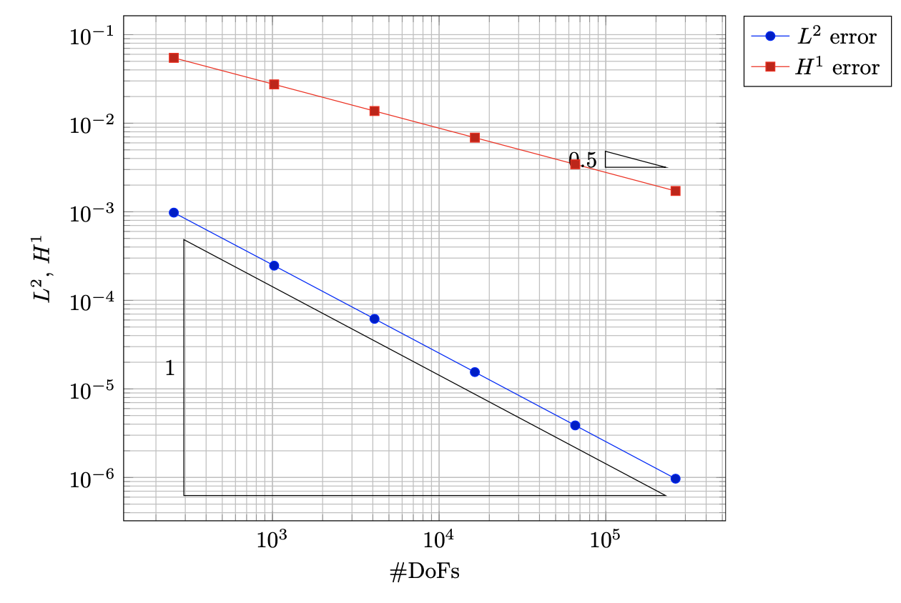
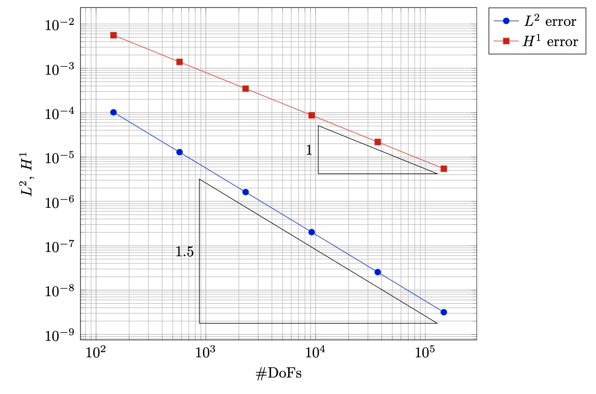
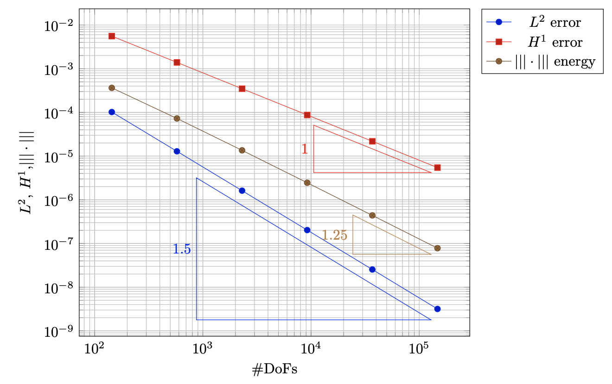
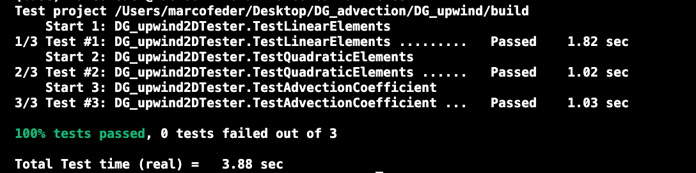

# DG Upwind [Work still in progress]


The convergence table obtained by building a smooth manufactured solution `u(x,y)=exp(x) sin(y)` and using:
- uniformly refined mesh at each cycle, rather than a broken-gradient based estimator 
- `fe_degree = 1`
- the r.h.s function, derived from `Function` base class has value `exp(x)*(cos(y)x - sin(y)y)`

```
cycle cells  dofs        L2             H1       
    0    64    256 9.776e-04    - 5.471e-02    - 
    1   256   1024 2.463e-04 1.99 2.744e-02 1.00 
    2  1024   4096 6.180e-05 1.99 1.373e-02 1.00 
    3  4096  16384 1.548e-05 2.00 6.871e-03 1.00 
    4 16384  65536 3.873e-06 2.00 3.436e-03 1.00 
    5 65536 262144 9.686e-07 2.00 1.718e-03 1.00
```

Which confirms the theoretical fact that for uniformly refined meshes and smooth solutions one usually see EOC `p+1`, with `p` the polynomial degree of the finite element. See also the following loglog plot w.r.t the DoFs 



Indeed, moving to biquadratic elements we observe the expected behaviour in terms of convergence rates. Notice that with an iterative solver you need to require high accuracy in order to observe the correct rates. Below you can see the desired convergence rate with `p=2`.




# Energy norm 

It's interesting to check that the a-priori error estimate in the energy norm is fulfilled. Hereafter we can see the correct `p+1/2` rate with biquadratic elements. It's worth mentioning that the terms in the sum have been assembled using the WorkStream namespace, as done in the assembly function. On the top of that, it's necessary to consider internal faces and boundary ones separately.



 


# Testing 

A GoogleTest framework has been chosen. In particular, it performs some convergence checks for different degrees, also in the advection reaction case, using a smooth manufactured solution. You can run those tests with `ctest` from command line. The produced output will be like, where only 3 tests are performed. 




You can add/change tests just by changing the `DG_upwind_tester.cc` file accordingly.