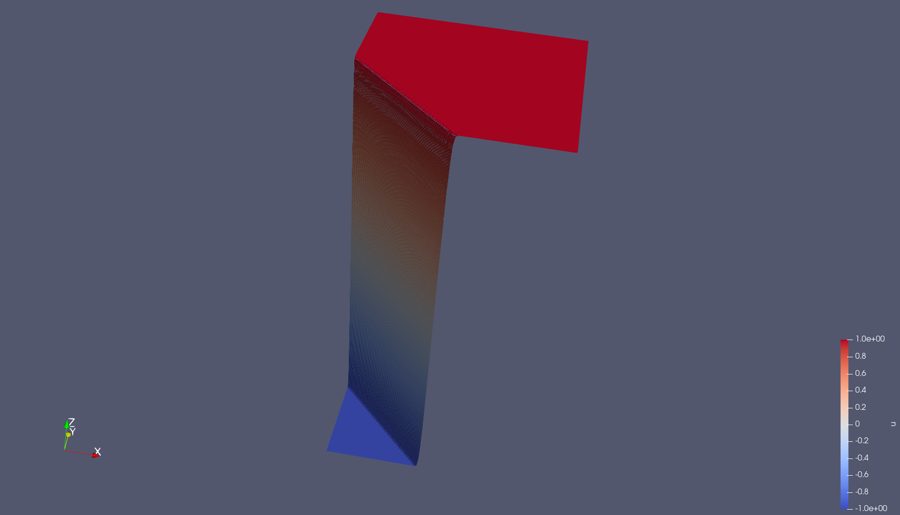
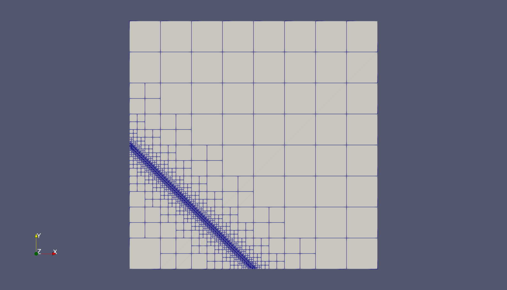

# Error estimator [in progress]

Results taken from the benchmark problem with internal layer along the line y=0.5-x.

Bulk chasing criterion with parameters `0.3` and `0.1` for refining and coarsening, respectively.

