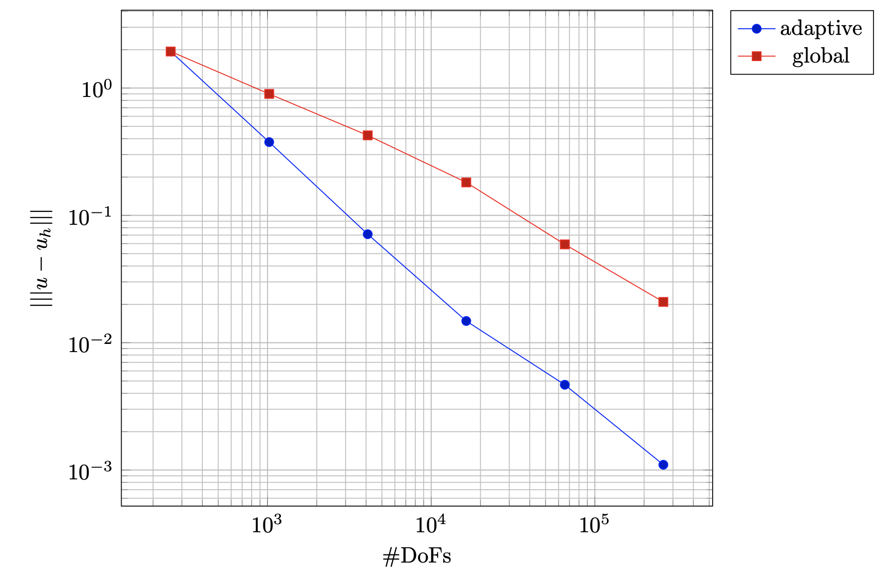

# DG for advection/reaction problems

# DG Upwind 

Collection of C++ programs that solve adaptively, with Discontinuous Galerkin methods, advection dominated equations in 2D/3D, using a numerical flux approach. In particular, allowing different choices of `theta` parameter  in the weak form, we can recover the classical upwind scheme. The crucial point is that only normal components of the averages enter in the scheme. See paper by Brezzi-Marini-Süli-M3AS-2004 for an extended discussion. 

The correctness of the implementation is checked by observing the expected convergence rates on a sequence of uniformly refined meshes, for which we have rates `p+1` and `p` in L2 and H1, assuming a *smooth* solution, which we've built manually.

The parameters like theta, degree of the elements, refining strategy, and so on can be handled and tuned just by changing the `parameters.prm` file, without the need to recompile. This feature is provided by the `FunctionParser<dim>` class.

The a-priori estimate in energy norm is optimal and holds for every penalty function s.t. `c_e >= theta*|beta * n|` where `theta` is a positive constant, independent of the edge `e` and the diameter of each cell. In the loglot plot below, the correct rates can be observed in the case `p=2`. Indeed, we have order `2+0.5 = 2.5` w.r.t `h`, hence we have the slope `1.25` if we plot against the number of DoFs. More details can be found in the README file of that folder.

# A-posteriori error estimator for first order hyperbolic problems

An implementation of a recent error estimator proposed by Georgoulis, Hall, Makridakis for first order hyperbolic problems. The reliability of the estimator is confirmed by different numerical tests in 2D, whereby the solution has internal layers. As can be seen, using the same number of DoFs the energy norm of the error is significantly smaller using the proposed estimator.

